# Tracker Phase 1b Design

**Status:** Approved direction, 2026-07-12  
**Program source:** `docs/plans/multiplanetary-tracker-execution-plan.md`  
**Phase goal:** Complete the Layer C core after the Phase 1a prototype without closing the still-unverified G1a operational gate.

## 1. Decisions and scope

Phase 1b is split into two independently testable work packages:

1. **WP1.2 collection upgrade:** generic full-text extraction, twelve feeds, application-level egress enforcement, and article-level retry/isolation.
2. **WP1.6 evaluation upgrade:** a second-context fluke filter and a usable human review UI with complete evidence context.

Semantic embedding merge is deliberately moved to Phase 2. The master plan's Phase 1b summary says "embedding merge", but the more specific WP1.5 contract says embedding similarity is added in Phase 2. The detailed WP text governs, and there is currently no approved embedding provider, model, secret, egress rule, or vector storage contract. Phase 1b retains the existing natural-key merger unchanged except for compatibility changes required by the two work packages above.

G1a remains open. Local H2/demo evidence proves the prototype code path, but it does not prove the required real-news E2E run, one-week unattended operation, or 30-classification audit. Phase 1b development may proceed in parallel without relabeling those missing operational results as complete.

### In scope

- RSS 2.0, RSS 1.0/RDF, and Atom parsing for the twelve configured sources.
- Full article fetches from explicitly registered HTTPS hosts only.
- Generic article extraction with no site-specific selectors.
- Bounded retries and RSS-summary fallback without blocking the relevance gate forever.
- Code-only quote verification against whichever body was preserved.
- Fluke filtering for high-impact, large-jump, and level 8-9 review cases.
- A token-gated review experience that exposes enough evidence for a human decision.
- Flyway V3 schema changes, source seed corrections, CNP additions, and configuration wiring.
- Deterministic tests with local fixtures and mocked LLM responses; no test invokes a live LLM API.

### Out of scope

- Embedding generation, vector storage, or semantic event clustering; these belong to Phase 2.
- Headless browsers or JavaScript execution for article extraction.
- Site-specific parsers or CSS selector maps.
- New pods, Kubernetes CronJobs, queues, or brokers.
- Closing G1a/G1; those gates require external operational evidence after deployment.
- Phase 2 golden sets, circuit breaker, deadman monitoring, and 35-node expansion.

## 2. Architectural approach

All new processing stays inside the existing Spring Boot deployment. Scheduled entry points use ShedLock and delegate to unlocked transactional methods so integration tests do not inherit lock rows across test transactions.

```mermaid
flowchart LR
    RSS["12 RSS/Atom feeds"] --> INGEST["TrackerIngestJob :10"]
    INGEST --> ARTICLE["article + RSS summary"]
    ARTICLE --> EXTRACT["BodyExtractionJob :15"]
    EXTRACT -->|success| FULL["full text / EXTRACTED"]
    EXTRACT -->|policy skip or retries exhausted| FALLBACK["RSS summary / SKIPPED or FAILED"]
    FULL --> GATE["RelevanceGate :20"]
    FALLBACK --> GATE
    GATE --> CLASSIFY["DeepClassifier"]
    CLASSIFY --> MERGE["EventMerger"]
    MERGE --> SCORE["ImpactScorer + StateUpdater"]
    SCORE -->|ordinary eligible event| ADVANCE["idempotent state advance"]
    SCORE -->|high impact / jump / L8-9| REVIEW["review_queue"]
    REVIEW --> FILTER["FlukeFilterJob, independent context"]
    FILTER --> UI["token-gated ReviewQueue UI"]
    UI -->|approve| ADVANCE
    UI -->|reject| REJECT["event REJECTED"]
```

Two alternatives were rejected:

- Performing article fetches and fluke calls synchronously inside existing jobs couples network latency to feed and state processing and weakens per-article failure isolation.
- A browser-rendering worker handles dynamic pages but adds a resource-heavy workload and a much larger security surface, conflicting with the free-tier and zero-trust constraints.

## 3. WP1.2: collection and full-text extraction

### 3.1 Components and boundaries

`ArticlePageFetcher` owns outbound HTTP policy and byte acquisition. It accepts a requested URI and an immutable set of allowed hosts and returns a bounded `FetchedPage` value containing the final URI, media type, charset hint, and bytes. It never parses article content.

`ArticleBodyExtractor` is a pure interface over fetched bytes and base URI. `JsoupReadabilityExtractor` implements it with jsoup 1.22.2. jsoup is a maintained HTML5 parser; the extractor adds a small, deterministic Readability-style density scorer. Readability4J is not used because its latest Maven release is 1.0.8 from 2021 and it adds a Kotlin runtime to the constrained backend.

`BodyExtractionJob` owns scheduling, batch limits, retry state, and repository transitions. Its scheduled wrapper runs at `0 15 * * * *`, uses the lock name `tracker-body-extraction`, and delegates to an unlocked `processPending()` method.

`TrackerIngestJob` remains responsible only for feed fetch, feed parsing, URL idempotency, and preserving the RSS title/summary. It catches failures per article as well as per feed, so one malformed item cannot discard later items from the same feed.

### 3.2 Schema and source policy

Flyway V3 adds a normalized `source_domain` policy table:

- `source_id` references `source_registry`.
- `domain` stores a lowercase ASCII hostname, never a wildcard or URL.
- `purpose` is `FEED`, `BODY`, or `BOTH`.
- `active` is `Y` or `N`.
- `(source_id, domain)` is unique; one row expresses the complete purpose for that host, so contradictory `FEED` and `BOTH` rows cannot coexist.

The existing `source_registry.site_domain` remains for backward compatibility and is seeded into `source_domain`. The normalized table is necessary because feeds and articles can use different hosts (for example `feeds.arstechnica.com` versus `arstechnica.com`) and some sources legitimately use more than one redirect host.

Flyway V3 also adds these article fields:

- `body_extraction_status`: `PENDING`, `EXTRACTED`, `SKIPPED`, or `FAILED`.
- `body_extraction_attempts`: non-negative attempt count.
- `body_extraction_error`: bounded diagnostic text with no response body or secret material.

Migration of existing rows is deterministic: `body_extracted='Y'` becomes `EXTRACTED`; all other existing rows become `SKIPPED`. New allowlisted article links are inserted as `PENDING`; links outside the source's body-domain policy are inserted as `SKIPPED`.

The twelve source codes are fixed to the existing WP0.4 registry: `NASA`, `ESA`, `JAXA`, `ARXIV`, `SPACENEWS`, `NASASPACEFLIGHT`, `SPACEFLIGHT_NOW`, `PLANETARY_SOCIETY`, `PHYSORG_SPACE`, `SPACE_COM`, `ARSTECHNICA_SPACE`, and `UNIVERSE_TODAY`. Their feed URLs are validated against the providers' current official feed pages during the first implementation task before seed or GitOps changes are accepted. Runtime `TRACKER_FEEDS` entries must resolve to active `FEED`/`BOTH` rows; unknown entries are rejected at startup instead of silently expanding egress.

### 3.3 Fetch security and resource bounds

The page fetcher enforces all of the following before every request and redirect:

- Scheme must be `https`; user info, fragments, and IP-literal hosts are rejected.
- Host must exactly equal an active body-domain row after IDN ASCII and lowercase normalization.
- Port must be absent or 443.
- At most three redirects are followed, and every target is revalidated.
- Connect timeout is 10 seconds; request timeout is 15 seconds.
- Only `text/html` and `application/xhtml+xml` are accepted.
- At most 2 MiB is read; larger responses are rejected without retaining their body.
- One shared `HttpClient` is reused, with no cookies and no script execution.
- Logs contain source code, article id, final host, and error class, but no body or credentials.

Application checks complement rather than replace Cilium. GitOps must explicitly add every active feed/body hostname to `toFQDNs`; a host is not considered deployable until it exists in both `source_domain` and the CNP.

### 3.4 Extraction algorithm

The extractor parses bytes with jsoup using the final URI as the base URI. It removes `script`, `style`, `noscript`, `nav`, `aside`, `form`, dialog, and hidden nodes. It scores generic block candidates (`article`, `main`, `section`, `div`) using paragraph text length, paragraph count, punctuation density, and heading proximity, with penalties for link density and boilerplate-like class/id terms. The highest candidate and adjacent text-bearing siblings form the output.

Whitespace is normalized without flattening paragraph boundaries. The preserved text is capped at 200,000 characters. An extraction under 500 non-whitespace characters is considered unsuitable and follows the explicit fallback path. No source name, hostname, CSS class, or site-specific selector appears in extraction code.

### 3.5 State flow and failures

`BodyExtractionJob` claims up to 30 oldest `PENDING` rows per tick. A successful extraction atomically replaces `article.body`, sets `body_extracted='Y'`, clears the error, and marks `EXTRACTED`.

Policy skips and unsupported media are terminal `SKIPPED` states with the RSS summary retained. Transient network or parser errors increment the attempt count. After three attempts the row becomes `FAILED`, retains the RSS summary, and is allowed to continue through the gate. Until the body state is terminal, `RelevanceGate` does not select the article. This prevents the classifier from racing ahead of a pending full-text fetch while preserving gap tolerance when extraction is impossible.

The original `pipeline_status` state machine is unchanged. Body extraction state is orthogonal, so existing API contracts and event processing remain backward compatible.

### 3.6 Feed and parser behavior

`RssParser` accepts RSS 2.0 `item`, RSS 1.0/RDF `item`, and Atom `entry`. It continues to disable DTDs and external entities. Atom links use the alternate link relation, and published time accepts RFC 1123 and ISO-8601 forms. Malformed entries are skipped individually; a malformed document fails only that feed.

URL hashing remains the insertion idempotency key. URL canonicalization beyond removal of the fragment is deferred because aggressive query normalization can merge distinct publisher pages and is not required by the current natural-key contract.

## 4. WP1.6: fluke filter and human review

### 4.1 Trigger and job separation

`StateUpdater` continues to calculate impact deterministically. If `ScoreResult.requiresReview()` is false, the existing auto-advance path is unchanged. If it is true, an idempotent review row is created and the event remains unadvanced.

Flyway V3 adds a unique constraint on `review_queue.event_id` and these fields:

- `priority`: `0` normal, `1` mismatch, `2` filter failure requiring attention.
- `fluke_status`: `PENDING`, `COMPLETE`, or `FAILED`.
- `fluke_fail_count`: bounded retry counter.
- `fluke_last_error`: bounded diagnostic text.

`FlukeFilterJob` runs after scoring, at `0 57 * * * *`, under the lock `tracker-fluke-filter`, and processes only pending reviews whose fluke status is `PENDING`. The job is gated by `tracker.fluke-enabled`, default `false`; disabling it never allows automatic state advancement.

### 4.2 LLM contract and audit record

The filter uses the same frontier model family as Stage 2 through `tracker.fluke-model`, defaulting to `tracker.classify-model`, but starts a new Anthropic request with a separate fixed system prompt. It receives the registered node definition, exact candidate claim, current node state, and verified evidence quotes. It does not receive the first classifier's reasoning.

The forced tool output contains only:

- `verdict`: `MATCH` or `MISMATCH`.
- `evidence_quote`: an exact quote from one supplied article body.

Code verifies the quote with the same whitespace-normalized substring rule used by `DeepClassifier`. An invalid quote is treated as a failed filter attempt, not as a verdict.

Flyway V3 adds `fluke_evaluation` with one successful evaluation per review: review/event ids, verdict, evidence quote, quote-verification flag, raw tool output, model id, prompt SHA-256, rubric version id, and timestamps. This satisfies the global version-stamp invariant and keeps `review_queue.fluke_result` as the denormalized list/sort field.

Both `MATCH` and `MISMATCH` require a human decision. A mismatch changes the reason to `FLUKE_MISMATCH` and raises priority; it never rejects or advances an event automatically.

### 4.3 Cost and failure behavior

Every filter request passes through `CostGuard`. When the daily cap is exhausted, the review remains pending without incrementing the failure count. Transient client, schema, or quote-verification failures increment the count. After three failures the filter status becomes `FAILED`, priority becomes 2, and automatic retries stop. A human can still approve or reject from the evidence shown in the UI.

No live API is required for development or CI. Tests mock `AnthropicClient`; the local demo runs with `tracker.fluke-enabled=false`. Production activation requires the existing Anthropic key and egress, plus a successful mocked/staging contract check.

### 4.4 Review API contract

The existing constant-time `X-Tracker-Admin-Token` check remains. The list endpoint returns review cases rather than bare queue rows. Each case includes:

- review id, reason, priority, filter status/result, and created time;
- event id/type/date/actor, verification level, impact score, and proposed level;
- node code/name, scale type, and current level;
- source count and verified evidence quotes with article title and URL;
- resolution status and reviewer note for resolved-case detail lookup.

Pending cases are ordered by priority descending and creation time ascending. Decision requests remain idempotent: only a `PENDING` row can transition, and concurrent or repeated decisions return `409`. Approval invokes the existing transactional state advance; rejection marks the event rejected. A rejection note is required; approval notes are optional but preserved.

### 4.5 Review UI

The React tracker area adds an admin-only review panel without adding a routing dependency. The operator enters the admin token; it is held only in component memory and sent as the request header. It is never bundled, logged, persisted to local/session storage, or placed in a URL.

The panel provides:

- priority and fluke-status filters;
- evidence, source links, current/proposed level, verification, and score in one case card;
- explicit approve and reject actions with confirmation;
- mandatory note validation for rejection;
- clear `401`, `409`, empty, loading, and retry states;
- immediate removal or resolved-state rendering after a successful decision.

The public countdown, radar, and timeline contracts remain unchanged.

## 5. Testing strategy

### WP1.2 automated evidence

- Pure extractor fixtures for at least four different generic layouts: semantic `article`, nested `div`, heavy navigation/sidebar, and malformed HTML.
- Assertions that body paragraphs and exact evidence sentences survive while navigation, ads, related links, scripts, and styles do not.
- Fetcher tests for HTTP rejection, user-info/IP literal rejection, unknown host, redirect escape, redirect limit, media type, timeout abstraction, and 2 MiB cap.
- Repository/state tests for `PENDING -> EXTRACTED`, `PENDING -> FAILED` after three attempts, and immediate `SKIPPED` fallback.
- Gate tests proving pending rows are not selected and terminal fallback rows are selected.
- RSS/RDF/Atom parser tests, malformed-entry isolation, duplicate URL insertion, and one-feed failure isolation.
- Configuration tests proving all twelve runtime feeds map to active policy rows.

### WP1.6 automated evidence

- Trigger tests for impact threshold, two-level jump, and level 8-9 rules.
- Forced tool-output tests for match, mismatch, bad enum, unmatched quote, cost deferral, retry, and terminal filter failure.
- Idempotency tests for duplicate scheduler scans and concurrent review decisions.
- Repository/API integration tests for priority ordering and the complete review-case projection.
- React tests for token handling, evidence rendering, approve/reject flows, rejection-note validation, and `401`/`409` behavior.
- Full backend and frontend regression after every task; the starting baselines are 127 backend tests and 34 frontend tests.

No automated test reaches an external feed or LLM. Network checks are a separate deployment verification step so CI remains deterministic.

## 6. Deployment and operational gates

WP1.2 GitOps changes extend the backend CNP only with domains that passed feed/redirect validation and exist in `source_domain`. `TRACKER_FEEDS` remains in OCI Vault through ESO; no feed list or token is committed as a secret. The existing pod resource requests are unchanged because no workload is added.

Deployment remains two-step:

1. Merge schema/CNP/config with tracker or new jobs disabled, then verify Flyway V3 and ESO/CNP reconciliation through Flux.
2. Enable collection, observe twelve-feed ingestion and extraction, then enable the fluke filter only after Anthropic contract readiness.

G1 requires evidence beyond tests: one real article must traverse feed, extraction, gate, classification, merge, verification, scoring, snapshot/ETA, and dashboard; 24-hour collection must show zero duplicate URLs and no cross-feed outage propagation; high-impact mocked/staging cases must appear in the review UI and require a human decision. These results are recorded separately and are not inferred from unit-test success.

## 7. Source references

- Master execution plan: `docs/plans/multiplanetary-tracker-execution-plan.md`
- Pipeline architecture: `docs/plans/wp/tracker-pipeline-architecture.md`
- Data model: `docs/plans/wp/tracker-data-model.md`
- Infrastructure prework and twelve-source list: `docs/plans/wp/tracker-infra-prework.md`
- Rubric and deterministic scoring: `docs/plans/wp/tracker-rubric-v1.md`
- jsoup official project: <https://github.com/jhy/jsoup>
- Mozilla Readability algorithm reference: <https://github.com/mozilla/readability>
- Readability4J Maven metadata: <https://central.sonatype.com/artifact/net.dankito.readability4j/readability4j>
- NASA official RSS directory: <https://www.nasa.gov/rss-feeds/>
- ESA official RSS directory: <https://www.esa.int/Services/RSS_Feeds>
